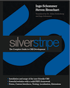

# Welcome to the SilverStripe developer documentation wiki

This wiki documents high-level features of the [SilverStripe open source platform](http://www.silverstripe.org), aimed
at developers. 
If you would like to contribute, you can [register](http://doc.silverstripe.com/doku.php?id=start&do=register) and then
[login](http://doc.silverstripe.com/doku.php?do=login&id=start).

###  Getting support

*  Use our [support forum](http://www.silverstripe.org/forums/) and [irc channel](http://silverstripe.org/irc)
*  See [userhelp](http://userhelp.silverstripe.com) for end-user documentation
    

### Overview

*  [Why SilverStripe?](http://silverstripe.com/overview/): Find out about our unique features as a new entrant in a
crowded market
*  [Feature Overview](http://silverstripe.com/overview/): Find out how many capabilities hide behind the simple
interface
*  [Contributing](http://www.silverstripe.com/how-to-contribute/) and [Contributors](Contributors)
*  [Changelog](http://open.silverstripe.org/wiki/ChangeLog)
*  [Roadmap](http://open.silverstripe.com/roadmap)
*  **[API documentation](http://api.silverstripe.org/current)**

###  Books

*  [Official book on SilverStripe in English](http://www.silverstripe.org/silverstripe-book)
([Errata](http://doc.silverstripe.org/silverstripe-book-errata)).
*  [Official book on SilverStripe in German](http://www.silverstripe.org/das-silverstripe-buch).

###  Installation

*  **[Installing](installation)** and [Upgrading](upgrading) 
*  [Server-requirements](server-requirements)
*  [Suggested-web-hosts](http://doc.silverstripe.org/suggested-web-hosts)

### Level 1: Building your first SilverStripe website

*  **[Tutorials](tutorials):**
    - [Building a basic site](tutorials/1-building-a-basic-site)
    - [Extending a basic site](tutorials/2-extending-a-basic-site)
    - [Forms](tutorials/3-forms)
    - [Site Search](tutorials/4-site-search)
    - [Relationships](tutorials/5-dataobject-relationship-management)

*  [Introduction to PHP5](http://devzone.zend.com/node/view/id/627)
*  [Common Problems](topics/common-problems)

### Level 2: SilverStripe fundamentals

*  [Templates](reference/templates): SilverStripe has its own templating engine
*  [Themes](topics/themes): How to customize your site with themes
*  [Controllers](topics/controllers): Coordination from a URL-request to finding the controller-class
*  [Pagetypes](topics/page-types): Clarifying the relationship between a page-object and a silverstripe-class
*  **[Datamodel](topics/datamodel)**: Object-relational database model with MVC
*  [Database Structure](reference/database-structure): Breakdown of a typical SilverStripe database
*  [Datatypes](topics/data-types): Casting database-columns
*  [Forms](topics/forms): Sophisticated form generation and processing
*  [Formfield Types](reference/form-field-types): Simple and complex form-elements with built-in validation
*  [Javascript](topics/javascript)
*  [Widgets](topics/widgets)
*  [Configuration](topics/configuration)

### Level 3: The less obvious features

*  [Execution Pipeline](reference/execution-pipeline): Tracking a request from director to template-rendering
*  [Email](topics/email)
*  [RSS Feeds](reference/rssfeed)
*  [Debugging](topics/debugging)
*  [Errorhandling](topics/error-handling)
*  [Testing Guide](testing/testing-guide): Framework for automated testing like Unittests
*  [Security](topics/security)
*  [Built-in Page Controls](reference/built-in-page-controls)

### Level 4: Contributing to the SilverStripe core

*  Share your [Recipes](http://doc.silverstripe.org/recipes)
*  [Coding Conventions](http://doc.silverstripe.org/coding-conventions)

### Modules

*  [Overview](topics/modules)

If you're interested in how work is being done on the SilverStripe documentation, you can see a [high-level view of the
number of changes here](http://doc.silverstripe.com/changegraph.php). If you are a customer of SilverStripe and are
looking for our company website, please visit [www.silverstripe.com](http://www.silverstripe.com). [Contact
us](http://www.silverstripe.com/contact).
